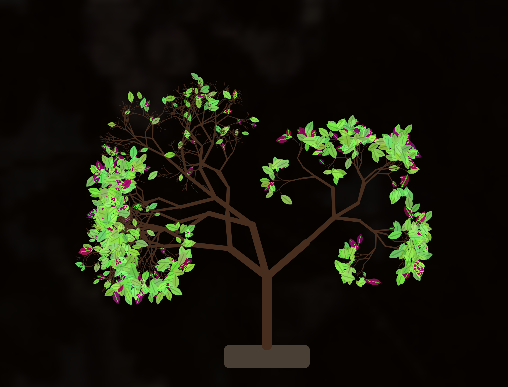
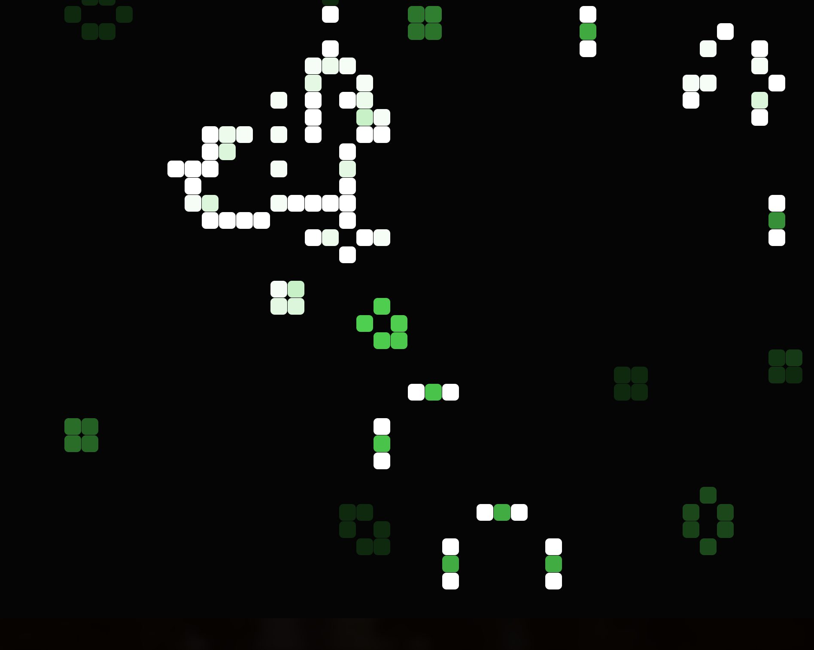
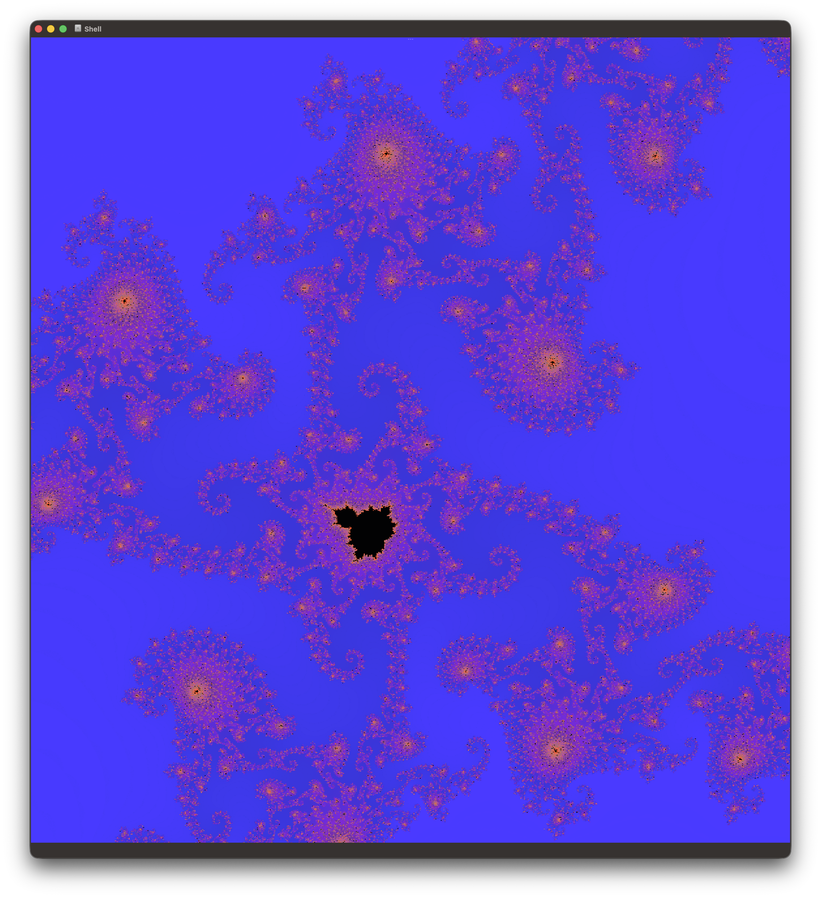
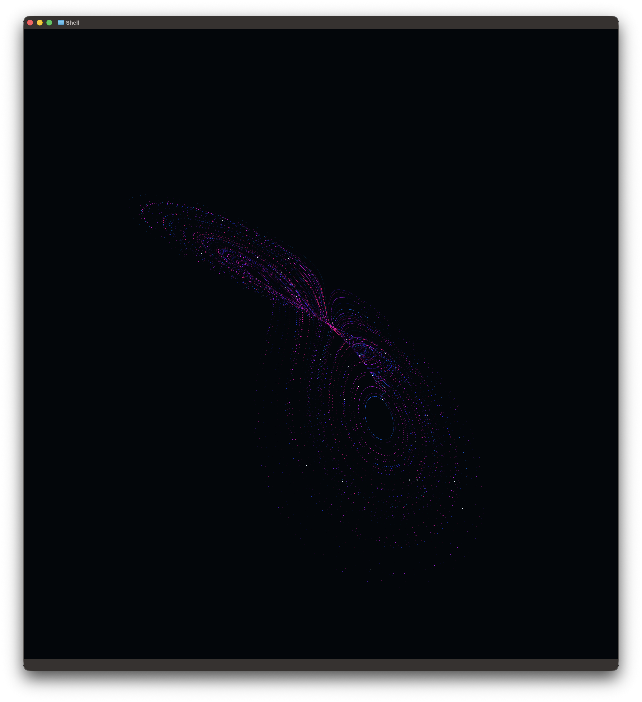
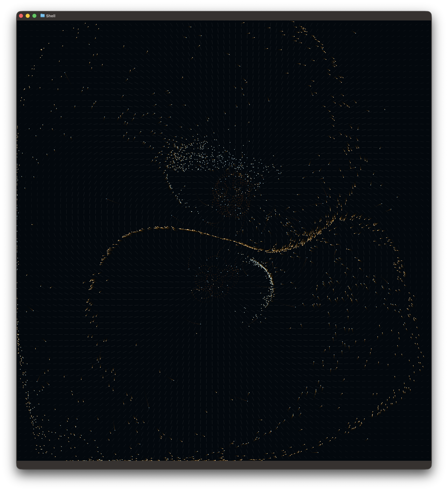

# Tiled Toys

	
	
	
	
	
	

	<em>gbonsai</em> — animated bonsai tree growth &nbsp;&nbsp;•&nbsp;&nbsp; <em>glife</em> — animated Conway's Game of Life &nbsp;&nbsp;•&nbsp;&nbsp; <em>gmandelbrot</em> — animated Mandelbrot exploration &nbsp;&nbsp;•&nbsp;&nbsp; <em>glorenz</em> — animated strange attractors (Lorenz/Rössler) &nbsp;&nbsp;•&nbsp;&nbsp; <em>gmagnetic</em> — animated magnetic field particle simulator &nbsp;&nbsp;•&nbsp;&nbsp; <em>gbrain</em> — animated NIfTI brain volume renderer

Small graphical terminal toys written in Go:

- `gbonsai`: animated bonsai tree growth
- `glife`: animated Conway's Game of Life with age-based coloring
- `gmandelbrot`: animated Mandelbrot fractal visualization with iterative low-to-high detail refinement
- `glorenz`: animated chaotic strange attractors (Lorenz and Rössler) with a 3D-to-2D terminal projection
- `gmagnetic`: animated charged particles flowing through a synthetic magnetic dipole field
- `gbrain`: animated ray-marched NIfTI brain volume rendering using opacity compositing

All are toy applications intended for **compatible terminals** that support the Kitty graphics protocol (or equivalent image escape support), such as [Ghostty](https://ghostty.org) or [Kitty](https://sw.kovidgoyal.net/kitty/). They work well as ambient visuals in **tiled window manager** layouts (e.g., [i3](https://i3wm.org/), [Hyprland](https://hyprland.org/), [Sway](https://swaywm.org/), [Awesome](https://awesomewm.org/), or [AeroSpace](https://github.com/nikitabobko/AeroSpace)). CPU consumption is generally very low, making them suitable for background visuals.

## System requirements

- MacOS or Linux
- Go toolchain installed (project currently targets recent Go releases)
- A terminal with image protocol support used by these apps (Kitty-compatible graphics escape sequences)
- `make` and standard Unix tools (`install`, `mkdir`, etc.)

## Repository layout

- [`gbonsai/`](gbonsai/)
- [`glife/`](glife/)
- [`gmandelbrot/`](gmandelbrot/)
- [`glorenz/`](glorenz/)
- [`gmagnetic/`](gmagnetic/)
- [`gbrain/`](gbrain/)

## Build

Build each app from its directory:

- `cd gbonsai && make build`
- `cd glife && make build`
- `cd gmandelbrot && make build`
- `cd glorenz && make build`
- `cd gmagnetic && make build`
- `cd gbrain && make build`

Or from repo root:

- `make -C gbonsai build`
- `make -C glife build`
- `make -C gmandelbrot build`
- `make -C glorenz build`
- `make -C gmagnetic build`
- `make -C gbrain build`

## Install

Both Makefiles support `PREFIX`, `BINDIR`, and `DESTDIR`.

Default install (to `$HOME/bin`):

- `make -C gbonsai install`
- `make -C glife install`
- `make -C gmandelbrot install`
- `make -C glorenz install`
- `make -C gmagnetic install`
- `make -C gbrain install`

Custom prefix:

- `make -C gbonsai install PREFIX=/usr/local`
- `make -C glife install PREFIX=/usr/local`
- `make -C gmandelbrot install PREFIX=/usr/local`
- `make -C glorenz install PREFIX=/usr/local`
- `make -C gmagnetic install PREFIX=/usr/local`
- `make -C gbrain install PREFIX=/usr/local`

Package staging example:

- `make -C gbonsai install DESTDIR=/tmp/pkgroot PREFIX=/usr/local`
- `make -C glife install DESTDIR=/tmp/pkgroot PREFIX=/usr/local`
- `make -C gmandelbrot install DESTDIR=/tmp/pkgroot PREFIX=/usr/local`
- `make -C glorenz install DESTDIR=/tmp/pkgroot PREFIX=/usr/local`
- `make -C gmagnetic install DESTDIR=/tmp/pkgroot PREFIX=/usr/local`
- `make -C gbrain install DESTDIR=/tmp/pkgroot PREFIX=/usr/local`

## Run

> For all the toys, to ensure low CPU consumption, use `--frame-stride` larger than 1 - PNG encoding for terminal graphics can be CPU-intensive.

### gbonsai

From repo root:

- `make -C gbonsai run`

Direct binary example:

- `./gbonsai/gbonsai -pause 30 -rate 10`

Useful flags:

- `-rate` growth steps per frame
- `-pause` seconds between trees
- `-frame-stride` render every N growth steps

### glife

From repo root:

- `make -C glife run`

Direct binary example:

- `./glife/glife -agecolour=cyan -spm=1000`

Useful flags:

- `-spm` simulation steps per minute
- `-agecolour` base color (`red`, `blue`, `green`, `purple`, `#RRGGBB`, etc.)
- `-cell-size` rendered cell size in pixels
- `-frame-stride` render every N simulation steps

### gmandelbrot

`gmandelbrot` will pick a random interesting area of the Mandelbrot set. It will also use GPU acceleration via [GoGPU](https://github.com/rajveermalviya/go-webgpu) (`--engine=auto|gpu|cpu`).

From repo root:

- `make -C gmandelbrot run`

Direct binary example:

- `./gmandelbrot/gmandelbrot -palette=fire -spm=480`

Useful flags:

- `-spm` animation steps per minute
- `-palette` color palette (`twilight`, `fire`, `ice`, `forest`, `mono`)
- `-math-mode` Mandelbrot kernel (`fixed` for faster integer math, or `float`)
- `-refine-steps` number of steps to refine from coarse to detailed rendering
- `-hold-steps` how long to linger after full refinement before switching area
- `-max-block` initial coarse pixel block size at the start of refinement
- `-iter-base` base Mandelbrot iteration budget at coarse refinement
- `-iter-max` maximum Mandelbrot iteration budget at full refinement
- `-frame-stride` render every N animation steps

### gbrain

`gbrain` will render 3D brain volumes from NIfTI files using ray marching and optional GPU acceleration (`-engine=auto|gpu|cpu`).

From repo root:

- `make -C gbrain run`

Direct binary example:

- `./gbrain/gbrain -nii=./gbrain/average305_t1_tal_lin.nii -spm=90`

Useful flags:

- `-nii` path to `.nii` or `.nii.gz` file
- `-rotation-speed` camera orbit speed (radians/second)
- `-zoom` camera zoom (`1.0` fits whole model; `>1` zooms in; `<1` zooms out)
- `-palette` color palette (`twilight`, `fire`, `ice`, `forest`, `mono`)
- `-palette-density` density palette override (defaults to `-palette`)
- `-palette-edge` edge palette used by `-color-mode=density-edge`
- `-color-mode` voxel colouring mode (`density`, `edge`, `density-edge`, `depth`, `normal`, `opacity`)
- `-engine` render engine (`auto`, `cpu`, `gpu`)
- `-opacity` base volume opacity (higher = less transparent)
- `-iso` soft density threshold to reveal structure boundaries
- `-edge-boost` edge/detail contrast multiplier
- `-tilt-max` max random tilt in degrees
- `-angle-change-sec` seconds between random tilt targets
- `-render-scale` internal render scale (lower = faster)
- `-samples` ray marching samples per ray
- `-max-dim` max loaded volume dimension (downsample for performance)
- `-frame-stride` render every N animation steps

### glorenz

`glorenz` will use GPU acceleration via [GoGPU](https://github.com/rajveermalviya/go-webgpu) (`--engine=auto|gpu|cpu`).

From repo root:

- `make -C glorenz run`

Direct binary example:

- `./glorenz/glorenz -system=lorenz -palette=fire -spm=900`

Useful flags:

- `-system` attractor equations (`lorenz` or `rossler`)
- `-palette` color palette (`twilight`, `fire`, `ice`, `forest`, `mono`)
- `-cloud` number of nearby particles rendered as a point cloud
- `-trail` trail length per particle
- `-spm` simulation steps per minute
- `-dt` integration step size
- `-substeps` integration updates per simulation step
- `-rotation-speed` camera orbit speed for the 3D projection
- `-frame-stride` render every N simulation steps

### gmagnetic

From repo root:

- `make -C gmagnetic run`

Direct binary example:

- `./gmagnetic/gmagnetic -palette=aurora -spm=900`

Useful flags:

- `-particles` number of charged particles
- `-trail` trail length per particle
- `-field-strength` global magnetic field multiplier
- `-rotation-speed` magnetic field rotation speed
- `-converge-speed` speed at which the pole distance shrinks over time
- `-palette` color palette (`aurora`, `fire`, `ice`, `mono`)
- `-spm` simulation steps per minute
- `-substeps` integration updates per simulation step
- `-dt` integration step size
- `-frame-stride` render every N simulation steps

## Notes

- If output appears blank or garbled, use a terminal that supports the required image protocol.
- These programs are intentionally lightweight visual toys, not production TUI applications.
